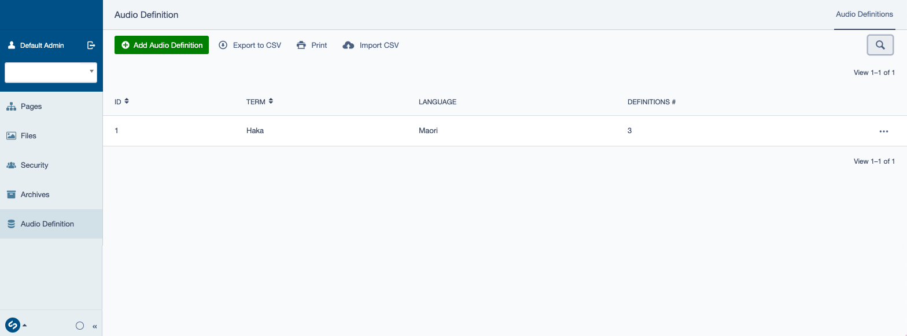
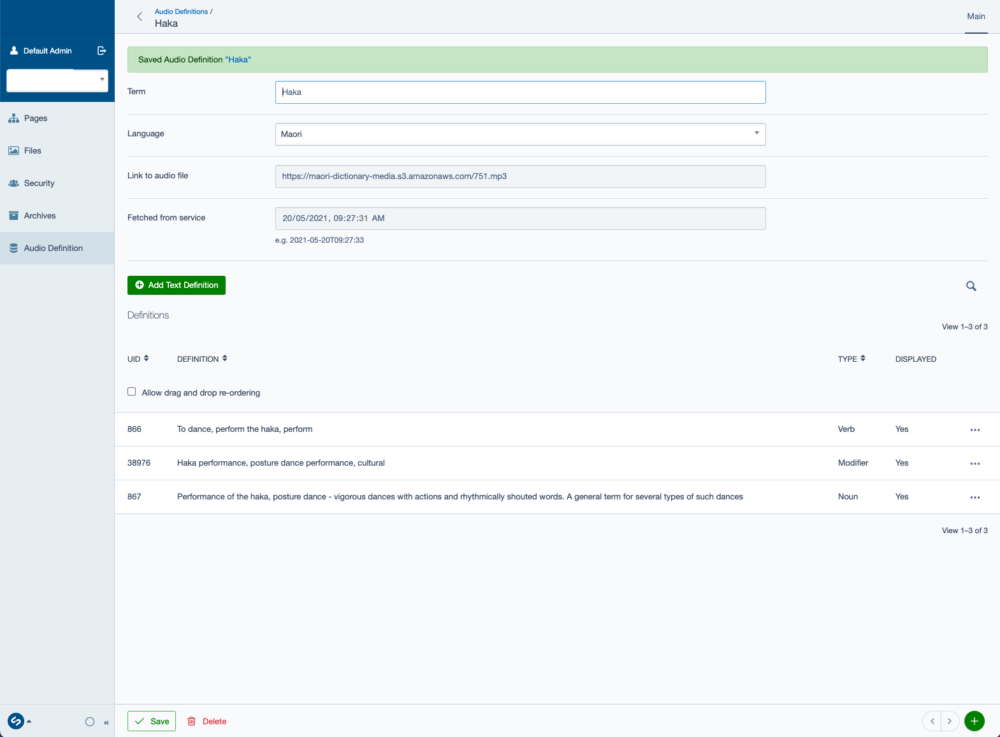
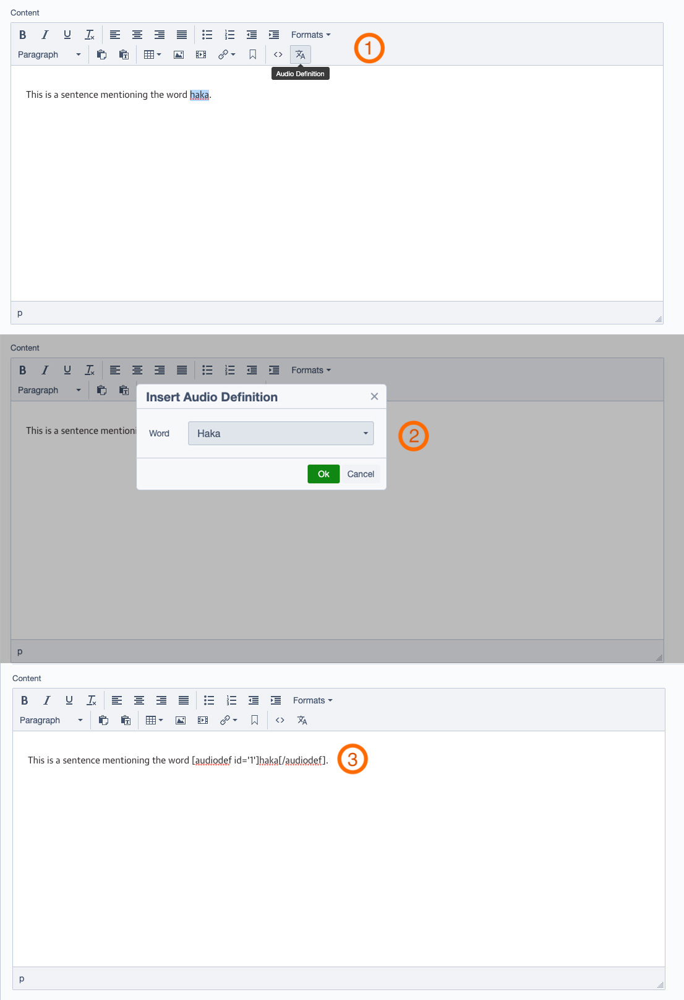

# Keywords text + audio definition for SilverStripe

## Introduction

This modules provides an interface to associate foreign words, within a content area, with an audio description and optional text definition. By Default, this module ships with the necessary interfaces for translating Te Reo Maori words and expressions via the [https://maoridictionary.co.nz](https://maoridictionary.co.nz) API.

## Requirements

- SilverStripe 5
- maoridictionary.co.nz API key (if using the default Te Reo Maori API)

## Installation

```
composer require dnadesign/silverstripe-audio-definition
```

## How to

### Create Definitions

In the CMS, open the Audio Definition interface, and click on `Add New`.
Type in the terms (could be one or more words) and select the language they are in (by default, only option is Maori).

If you are using an API and it is set up correctly, the `Link to Audio file` and `Text Definitions` should be populated upon saving.
If no API is provided, you can add `Text Definitions` manually.




### Insert definitions in a content area

This module adds a button to the default Silverstripe text editor (currently TinyMCE 6) allowing a user to insert a shortcode which renders the audio definition.
To add the shortcode, select the word you wish to associate with the definition, click on the `audio defnintion` button and select the correct term. If the selected text matches any of the audio definition term, it will be selected by default.



### Customise definition appearance

By default, the rendered definition is a `span` with the correct `lang` attribute set.
In addition, if an audio file is supplied, a button will precede the word which will play the audio when clicked.

It is recommended that you override the `DNADesign\AudioDefinition\AudioDefinition` template to suit you needs.
For instance, you could add the text definition in a tooltip displayed when a user hovers over the word.

As an example, this is the markup you could use with [tippy.js](https://atomiks.github.io/tippyjs/)

```
<%-- Keep outer span for accessibility, aria-expanded will be added to it by tippy --%>
<% if $DefinitionsToDisplay %>
<span class="audiodef-wrapper">
    <span tabindex="0" role="button" class="audio-definition-button" lang="$LangAttr" data-tooltip-trigger aria-expanded="false">$Content.RAW</span>
    <span class="tooltip-template audiodef-tooltip" style="display: none;" data-tippy-theme="wreda-theme--light">
        <button class="tooltip-close button-close" data-tooltip-close aria-label="close">$SVG('cross')</button>
        <span class="audiodef-tooltip__title">
            <% if $LinkToAudioFile %><button class="audiodef-trigger button-speaker" aria-controls="audiodef-player-{$ID}" type="button" aria-label="pronounce">$SVG('speaker')</button><% end_if %>
            <dfn>$Term</dfn>
        </span>
        <% if $DefinitionsToDisplay %>
            <% loop $DefinitionsToDisplay %>
                <span class="audiodef-tooltip__definition">
                    <span class="audiodef-tooltip__definition-content">$Content.RAW</span>
                    <span class="audiodef-tooltip__definition-type">$Top.LanguageName | $Type</span>
                </span>
            <% end_loop %>
        <% end_if %>
    </span>
<span>
<%-- Keep audio player outside the tippy template as it gets duplicated --%>
<% if $LinkToAudioFile %>
    <audio id="audiodef-player-{$ID}" crossorigin="anonymous">
        <source src="$LinkToAudioFile" type="audio/mpeg">
    </audio>
<% end_if %>
<% else %>
    $Content.RAW
<% end_if %>
```

### Add different languages/translators

If you would like to add a different language to choose from when creating a definition, you can add a new locale to the AudioDefinition sources via the config:

```
DNADesign\AudioDefinition\Models\AudioDefinition:
  sources:
    es_ES: 'SpanishTranslationServiceClass'
```

A translation service is optional. If you choose to use one, you can create a new service which must implement `DNADesign\AudioDefinition\Services`. This class must define a method `getDefinitionAndAudio` which returns an array that must contain:

```
$data = [
    'audioSrc' => 'Link to audio file',
    'definitions' => [
        [
            'id' => 'Unique id of the definition (optional),
            'type' => 'Eg: noun, verb (optional),
            'content' => 'The text definition'
        ]
    ]
]
```

## Extensions

### Context Extension

Some languages can have multiple text definitions for the same word depending on the context.
To tag different text definitions with keywords that depict a context, activate the context extension for the locale as follows:

```
DNADesign\AudioDefinition\Models\TextDefinition:
  use_context_for_locales:
    - mi_NZ
```

Once activated, users can create contexts in the Audio Definition > Contexts tab, then tag text definitions with one or more contexts.
This won't have an influence on the way the definitions are displayed out-of-the-box, but if you implement a way of displaying the text definitions, then these can be filtered by context.

**Note**: if at least one text definition is tagged with a context, the wysiwyg dropdown will give the choice of word with a context. If a word is required to display all definitions, then each definition will need to be tagged with the "default" context.

**Note**: if you add the context config before running dev/build after installing the module, you will need to run dev/build twice for all the tables to be created.

## NOTES

Icons made by [Pixel perfect](https://www.flaticon.com/authors/pixel-perfect) from [www.flaticon.com](https://www.flaticon.com/)
